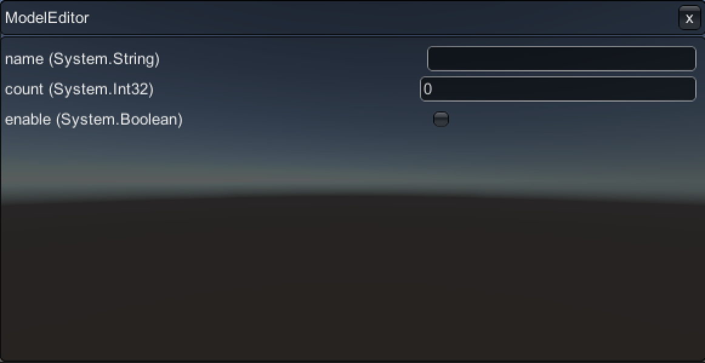

# runtime-object-editor
Unity実行中にオブジェクトの値を編集するパッケージです

## 導入
[unity-packman](https://github.com/appetizermonster/unity-packman)を使ってinstallしてください
```
$ unity-packman install hwthon/runtime-object-editor
```

## 使う
### 編集するオブジェクトの定義をする
UnityのSerializationと同じように定義してください
```C#
[System.Serializable]
public class SampleObject
{
  public string name;
  public int count;

  [SerializeField]
  private bool enable;
}
```

### Editorを表示する
EditorはUnityのGUIイベントで描画するのでMonoBehaviourを必要とします
gameObjectにコンポーネントを追加して`Open`メソッドにオブジェクトを渡して表示してください
```C#
gameObject.AddComponent<ObjectEditor>().Open(new SampleObject(), OnClosed);
```

## 画面イメージ
UIは改善予定です
  
